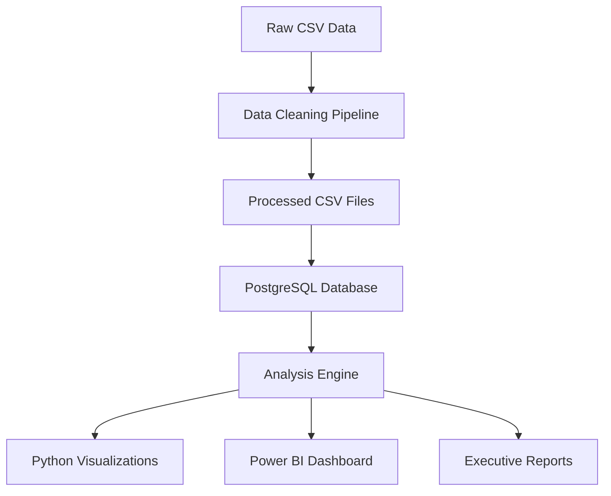

# Design Document

## Overview

The Wuzzuf Job Market Analysis system is designed as a comprehensive data pipeline that transforms raw job posting data into actionable business insights. The architecture follows a traditional ETL (Extract, Transform, Load) pattern with additional layers for analysis, visualization, and reporting. The system processes approximately 25,000 job records through multiple stages: data cleaning, database storage, analytical processing, and dashboard creation.

## Architecture

### High-Level Architecture



### Component Flow

1. **Data Ingestion Layer**: Reads raw Wuzzuf-Jobs-Posting.csv
2. **Data Processing Layer**: Jupyter notebooks for cleaning and transformation
3. **Storage Layer**: PostgreSQL database with normalized schema
4. **Analysis Layer**: SQL queries and pandas operations for business insights
5. **Visualization Layer**: Python charts and Power BI dashboard
6. **Documentation Layer**: README, SQL scripts, and executive summary

## Components and Interfaces

### Data Processing Components

**DataCleaner Class**
- Input: Raw CSV file
- Output: Cleaned jobs.csv, skills.csv, job_skills.csv
- Methods: clean_text(), parse_skills(), normalize_experience(), split_location()

**DatabaseManager Class**
- Input: Processed CSV files
- Output: Populated PostgreSQL database
- Methods: create_schema(), insert_data(), execute_query()

**AnalysisEngine Class**
- Input: Database connection
- Output: Analysis results and visualizations
- Methods: analyze_roles(), analyze_skills(), analyze_salaries(), create_charts()

### Interface Specifications

**File Interfaces**
- Input: Wuzzuf-Jobs-Posting.csv (18 columns, ~25K rows)
- Intermediate: jobs.csv, skills.csv, job_skills.csv
- Output: Charts (PNG), Dashboard (PBIX), Reports (MD)

**Database Interfaces**
- Connection: PostgreSQL via SQLAlchemy
- Schema: 4 tables with foreign key relationships
- Queries: 6 analytical queries for business questions

## Data Models

### Database Schema

**jobs table**
```sql
CREATE TABLE jobs (
    job_id BIGINT PRIMARY KEY,
    posting_date DATE NOT NULL,
    job_title VARCHAR(255) NOT NULL,
    job_title_full VARCHAR(500),
    position_type VARCHAR(50),
    experience_level VARCHAR(20),
    years_experience INTEGER,
    city VARCHAR(100),
    country VARCHAR(100),
    salary_min DECIMAL(10,2),
    salary_max DECIMAL(10,2),
    pay_rate VARCHAR(20),
    applicants INTEGER,
    company_id INTEGER REFERENCES companies(company_id),
    posting_year INTEGER,
    posting_month INTEGER
);
```

**companies table**
```sql
CREATE TABLE companies (
    company_id SERIAL PRIMARY KEY,
    company_name VARCHAR(255) NOT NULL,
    industry VARCHAR(100),
    company_size VARCHAR(50)
);
```

**skills table**
```sql
CREATE TABLE skills (
    skill_id SERIAL PRIMARY KEY,
    skill_name VARCHAR(100) UNIQUE NOT NULL,
    skill_category VARCHAR(50)
);
```

**job_skills table**
```sql
CREATE TABLE job_skills (
    job_id BIGINT REFERENCES jobs(job_id),
    skill_id INTEGER REFERENCES skills(skill_id),
    PRIMARY KEY (job_id, skill_id)
);
```

### Data Transformation Rules

**Experience Level Mapping**
- Entry: 0-2 years experience
- Mid: 3-5 years experience  
- Senior: 6+ years experience

**Skills Normalization**
- Convert to lowercase
- Remove special characters and spaces
- Standardize synonyms: "power bi" → "powerbi", "ms excel" → "excel"
- Categorize as technical vs soft skills

**Location Processing**
- Split "City, State" format into separate city and country columns
- Handle "United States" as country when no city specified
- Standardize city names and country codes

## Error Handling

### Data Quality Issues

**Missing Data Strategy**
- Job Skills: Keep records with empty skills arrays
- Salary Data: Preserve records without salary information for non-salary analyses
- Location: Use "Unknown" for missing location data
- Experience: Default to 0 for missing years of experience

**Data Validation Rules**
- Job Posting ID: Must be unique and non-null
- Posting Date: Must be valid date format
- Salary Values: Must be positive numbers when present
- Experience Years: Must be non-negative integers

**Error Recovery**
- Log all data quality issues to processing log
- Continue processing with cleaned data
- Generate data quality report showing records affected
- Provide fallback values for critical missing fields

### System Error Handling

**Database Connection Failures**
- Implement connection retry logic with exponential backoff
- Provide clear error messages for connection issues
- Fallback to CSV-based analysis if database unavailable

**File Processing Errors**
- Validate file format and structure before processing
- Handle encoding issues with UTF-8 fallback
- Skip malformed rows with logging

## Testing Strategy

### Unit Testing

**Data Cleaning Tests**
- Test skill parsing with various input formats
- Validate experience level bucketing logic
- Test location splitting edge cases
- Verify salary data cleaning and conversion

**Database Tests**
- Test schema creation and table relationships
- Validate data insertion and foreign key constraints
- Test query performance with sample data
- Verify data integrity after insertion

### Integration Testing

**End-to-End Pipeline Tests**
- Test complete data flow from CSV to database
- Validate analysis results against expected outputs
- Test visualization generation and file saving
- Verify Power BI data import functionality

### Data Quality Testing

**Business Logic Validation**
- Verify business question results match expected patterns
- Test edge cases in salary and experience analysis
- Validate skill categorization accuracy
- Check location data consistency

**Performance Testing**
- Measure processing time for full dataset
- Test database query performance
- Validate memory usage during processing
- Ensure visualization generation completes within reasonable time

### Acceptance Testing

**Portfolio Requirements**
- Verify all required files are generated in correct structure
- Test README documentation completeness
- Validate dashboard functionality and interactivity
- Ensure all charts are properly saved and formatted