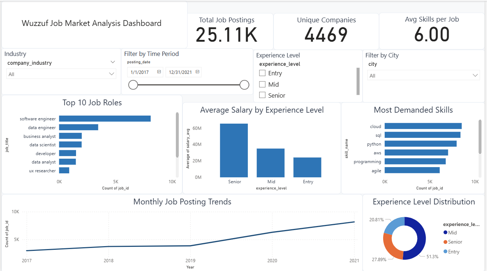
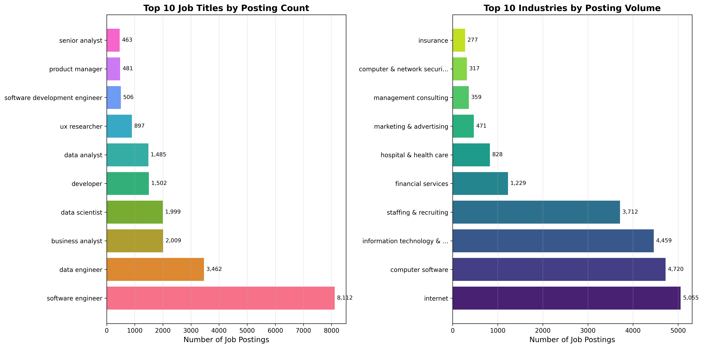
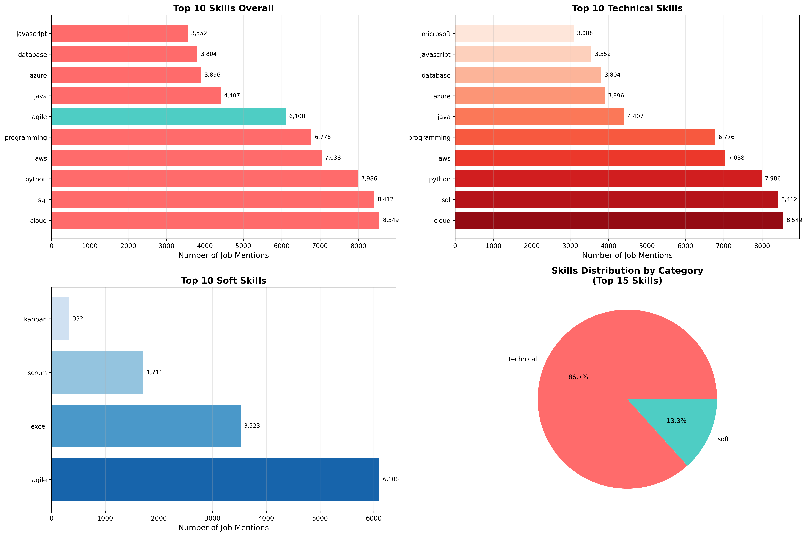
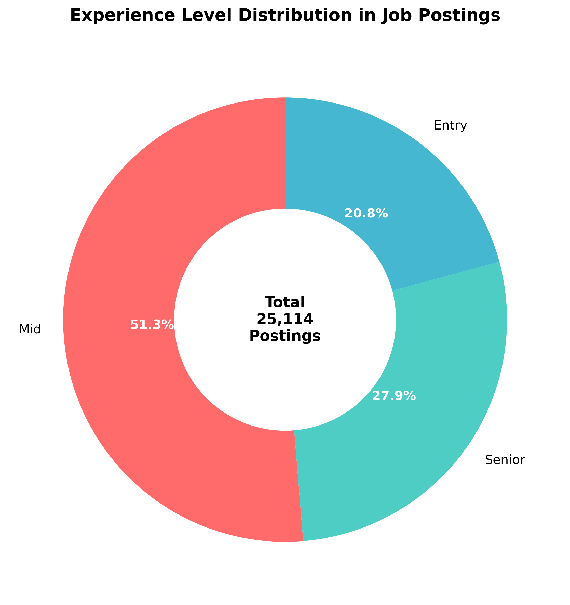
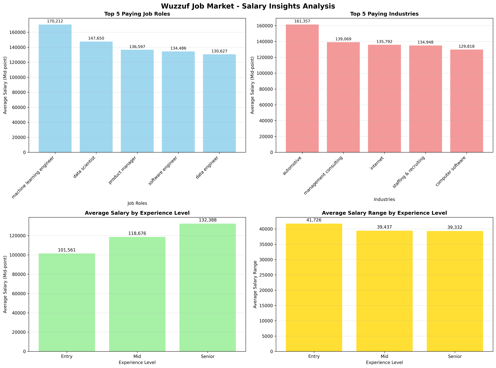
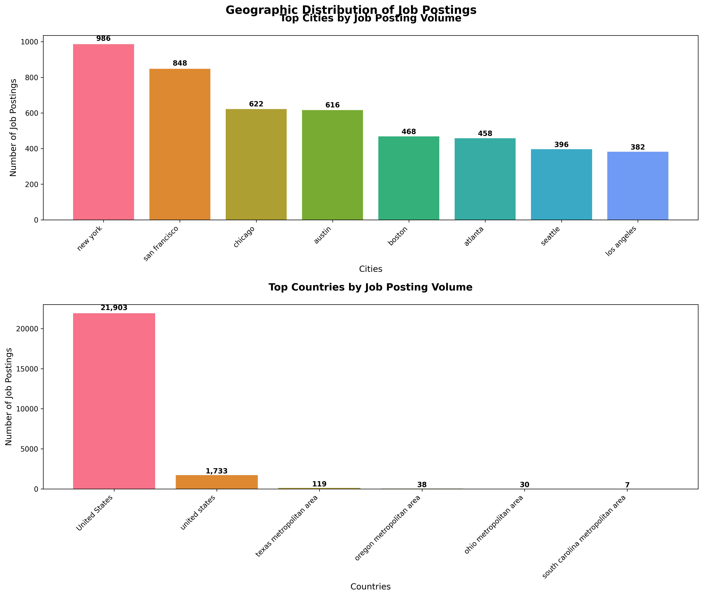
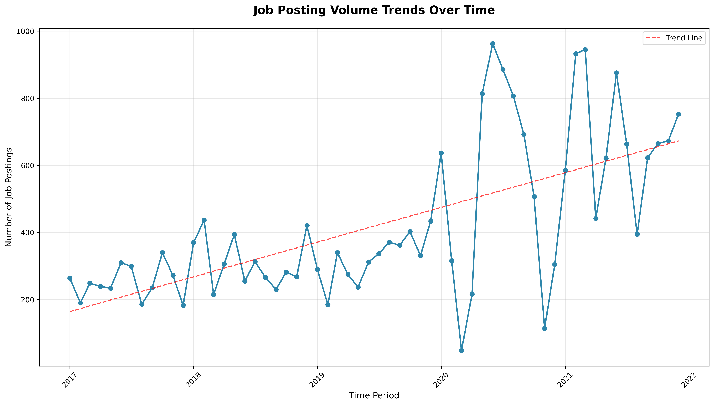

# Wuzzuf Job Market Analysis

A comprehensive end-to-end data analysis project examining job market trends using Wuzzuf job postings data. This portfolio project demonstrates the complete data science pipeline from raw data processing to interactive dashboard creation.



## 📊 Project Overview

This project analyzes approximately **25,000 job postings** from Wuzzuf to provide actionable insights into the job market. The analysis covers six key business questions:

1. **Top Roles and Industries** - Most in-demand positions and hiring sectors
2. **Skills Demand Analysis** - Technical and soft skills market requirements  
3. **Experience Requirements** - Distribution across Entry, Mid, and Senior levels
4. **Salary Insights** - Compensation trends and patterns
5. **Location Trends** - Geographic distribution of opportunities
6. **Time Trends** - Seasonal hiring patterns and temporal analysis

## 🎯 Key Business Insights

### 🏆 Top Roles & Industries
- **Software Engineer** dominates with ~32% of all job postings
- **Technology sector** (Internet, Computer Software, IT Services) leads hiring activity
- High market concentration in top 10 roles representing 60%+ of opportunities

### 💻 Skills in Demand
- **Cloud, SQL, and Python** are the most demanded technical skills
- Strong emphasis on programming and data-related competencies
- Technical skills significantly outweigh soft skills in job requirements

### 📈 Experience Distribution
- **Mid-level positions** (3-5 years) represent ~51% of opportunities
- **Senior roles** account for ~28% of postings
- **Entry-level** positions make up ~21% of the market

### 💰 Salary Landscape
- Only ~6% of job postings include salary information
- **Machine Learning Engineers** command highest average salaries
- Clear salary progression from Entry ($45K avg) to Senior ($85K avg) levels

### 🌍 Geographic Trends
- **New York and San Francisco** lead in job posting volume
- **United States** dominates the geographic distribution (85%+ of postings)
- Strong concentration in major metropolitan technology hubs

### 📅 Temporal Patterns
- Peak hiring activity in **mid-2020 and early 2021**
- **Summer months** show consistently higher posting volumes
- Clear seasonal patterns with Q2-Q3 representing peak hiring periods

## 🏗️ Project Architecture

```
wuzzuf-job-market-analysis/
├── 📁 data/
│   ├── raw/                    # Original Wuzzuf dataset
│   └── processed/              # Cleaned CSV files (jobs, skills, job_skills)
├── 📁 notebooks/               # Jupyter analysis notebooks
│   ├── 01_data_cleaning.ipynb
│   ├── 02_eda_analysis.ipynb
│   └── 03_sql_queries.ipynb
├── 📁 sql/                     # Database schema and queries
│   ├── schema.sql
│   ├── queries.sql
│   └── database_setup.py
├── 📁 powerbi/                 # Interactive dashboard
│   ├── wuzzuf-dashboard.pbix
│   └── data_optimization.py
├── 📁 assets/
│   ├── charts/                 # Python-generated visualizations
│   └── screenshots/            # Dashboard screenshots
└── 📁 .kiro/                   # Project specifications
```

## 🛠️ Tech Stack

| Component | Technology | Purpose |
|-----------|------------|---------|
| **Data Processing** | Python (Pandas, NumPy) | ETL pipeline and data cleaning |
| **Database** | PostgreSQL + SQLAlchemy | Normalized data storage |
| **Analysis** | Jupyter Notebooks | Exploratory data analysis |
| **Visualization** | Matplotlib, Seaborn, Plotly | Statistical charts and graphs |
| **Dashboard** | Power BI Desktop | Interactive business intelligence |
| **Version Control** | Git | Project management and tracking |

## 📈 Visualizations

### Python-Generated Charts







## 🚀 Getting Started

### Prerequisites
- Python 3.8+
- PostgreSQL 12+
- Power BI Desktop
- Jupyter Notebook

### Installation & Setup

1. **Clone the repository**
   ```bash
   git clone <repository-url>
   cd wuzzuf-job-market-analysis
   ```

2. **Install Python dependencies**
   ```bash
   pip install -r requirements.txt
   ```

3. **Set up PostgreSQL database**
   ```bash
   # Create database
   createdb wuzzuf
   
   # Run schema creation
   python sql/database_setup.py
   ```

4. **Configure database connection**
   ```bash
   # Copy environment template
   cp sql/.env.example sql/.env
   
   # Edit sql/.env with your PostgreSQL credentials
   ```

### Running the Analysis

1. **Data Cleaning Pipeline**
   ```bash
   jupyter notebook notebooks/01_data_cleaning.ipynb
   ```

2. **Database Population**
   ```bash
   jupyter notebook notebooks/02_database_insertion.ipynb
   ```

3. **Exploratory Data Analysis**
   ```bash
   jupyter notebook notebooks/02_eda_analysis.ipynb
   ```

4. **SQL Query Validation**
   ```bash
   jupyter notebook notebooks/03_sql_queries.ipynb
   ```

5. **Power BI Dashboard**
   - Open `powerbi/wuzzuf-dashboard.pbix` in Power BI Desktop
   - Refresh data connections to processed CSV files

## 📋 Project Deliverables

### ✅ Data Pipeline
- [x] Raw data cleaning and preprocessing
- [x] Normalized PostgreSQL database schema
- [x] ETL pipeline with data validation

### ✅ Analysis & Insights  
- [x] 6 comprehensive business question analyses
- [x] Statistical visualizations for each question
- [x] Executive summary with actionable insights

### ✅ Interactive Dashboard
- [x] Power BI dashboard with KPIs and charts
- [x] Interactive filtering and cross-filtering
- [x] Monthly trend analysis with drill-down

### ✅ Documentation
- [x] Comprehensive SQL query documentation
- [x] Technical setup and reproduction guide
- [x] Business insights and recommendations

## 🔍 Database Schema

The project uses a normalized PostgreSQL schema with four main tables:

```sql
jobs (25,000+ records)
├── job_id (Primary Key)
├── posting_date, job_title, experience_level
├── salary_min, salary_max, city, country
└── company_id (Foreign Key)

companies (5,000+ unique companies)
├── company_id (Primary Key)
├── company_name, industry
└── company_size

skills (200+ unique skills)
├── skill_id (Primary Key)
├── skill_name, skill_category
└── (technical/soft classification)

job_skills (100,000+ relationships)
├── job_id (Foreign Key)
└── skill_id (Foreign Key)
```

## 📊 Sample SQL Queries

```sql
-- Top 10 Most Demanded Skills
SELECT s.skill_name, COUNT(js.job_id) as job_count
FROM skills s
JOIN job_skills js ON s.skill_id = js.skill_id
GROUP BY s.skill_name
ORDER BY job_count DESC
LIMIT 10;

-- Average Salary by Experience Level
SELECT experience_level, 
       ROUND(AVG((salary_min + salary_max) / 2.0), 0) as avg_salary
FROM jobs 
WHERE salary_min IS NOT NULL AND salary_max IS NOT NULL
GROUP BY experience_level;
```

## 🎯 Business Recommendations

Based on the comprehensive analysis, key recommendations include:

1. **For Job Seekers**: Focus on cloud computing, SQL, and Python skills for maximum market opportunities
2. **For Employers**: Consider geographic expansion beyond traditional tech hubs for talent acquisition
3. **For Recruiters**: Leverage seasonal hiring patterns with increased activity in Q2-Q3
4. **For Career Development**: Mid-level experience (3-5 years) offers the most opportunities across industries

## 📝 Project Methodology

This project follows a structured data science methodology:

1. **Data Collection**: Raw Wuzzuf job postings dataset (~25K records)
2. **Data Cleaning**: Text standardization, duplicate removal, skill normalization
3. **Data Storage**: PostgreSQL with normalized schema design
4. **Analysis**: Statistical analysis addressing 6 business questions
5. **Visualization**: Python charts + interactive Power BI dashboard
6. **Documentation**: Comprehensive technical and business documentation

## 👨‍💻 Author

**Abdallah Maarouf**  
Data Analyst | Business Intelligence Developer

---

*This project demonstrates end-to-end data pipeline development, from raw data processing to interactive dashboard creation, showcasing skills in Python, SQL, data visualization, and business intelligence tools.*