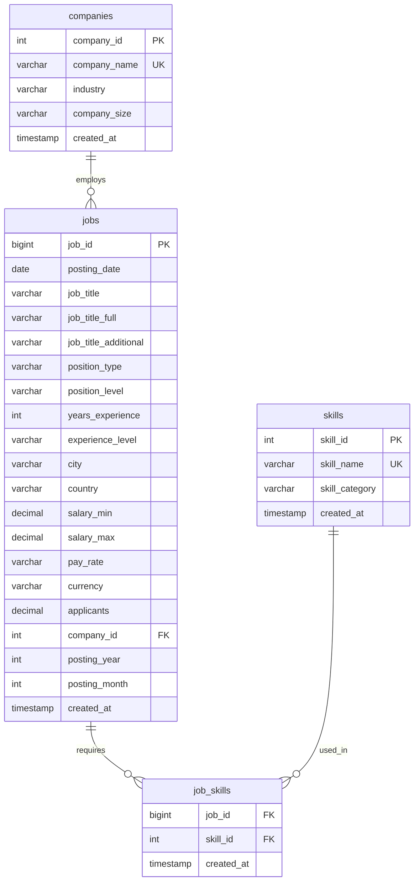

# Wuzzuf Job Market Analysis - Database Schema Documentation

## Overview

The Wuzzuf database is designed using a normalized relational schema to efficiently store and analyze job market data. The schema consists of four main tables with proper relationships and constraints to ensure data integrity.

## Database Schema Diagram



## Table Specifications

### 1. companies
**Purpose**: Stores unique company information extracted from job postings

| Column | Type | Constraints | Description |
|--------|------|-------------|-------------|
| company_id | SERIAL | PRIMARY KEY | Auto-incrementing unique identifier |
| company_name | VARCHAR(255) | NOT NULL, UNIQUE | Company name (normalized) |
| industry | VARCHAR(100) | | Industry classification |
| company_size | VARCHAR(50) | | Employee count range |
| created_at | TIMESTAMP | DEFAULT CURRENT_TIMESTAMP | Record creation timestamp |

**Indexes**:
- `idx_companies_name` on company_name
- `idx_companies_industry` on industry

### 2. jobs
**Purpose**: Main table storing comprehensive job posting information

| Column | Type | Constraints | Description |
|--------|------|-------------|-------------|
| job_id | BIGINT | PRIMARY KEY | Original job posting ID from dataset |
| posting_date | DATE | NOT NULL | Date when job was posted |
| job_title | VARCHAR(255) | NOT NULL | Standardized job title |
| job_title_full | VARCHAR(500) | | Full job title from original posting |
| job_title_additional | VARCHAR(500) | | Additional title information |
| position_type | VARCHAR(50) | | Employment type (full-time, part-time, etc.) |
| position_level | VARCHAR(100) | | Position level description |
| years_experience | INTEGER | CHECK >= 0 | Required years of experience |
| experience_level | VARCHAR(20) | CHECK IN ('Entry', 'Mid', 'Senior') | Bucketed experience level |
| city | VARCHAR(100) | | Job location city |
| country | VARCHAR(100) | | Job location country |
| salary_min | DECIMAL(12,2) | CHECK >= 0 | Minimum salary offered |
| salary_max | DECIMAL(12,2) | CHECK >= 0 | Maximum salary offered |
| pay_rate | VARCHAR(20) | | Salary payment frequency |
| currency | VARCHAR(10) | | Salary currency |
| applicants | DECIMAL(10,1) | CHECK >= 0 | Number of applicants |
| company_id | INTEGER | FOREIGN KEY | Reference to companies table |
| posting_year | INTEGER | CHECK 2000-2030 | Year extracted from posting_date |
| posting_month | INTEGER | CHECK 1-12 | Month extracted from posting_date |
| created_at | TIMESTAMP | DEFAULT CURRENT_TIMESTAMP | Record creation timestamp |

**Constraints**:
- `salary_range_check`: Ensures salary_max >= salary_min when both are present

**Indexes**:
- `idx_jobs_posting_date` on posting_date
- `idx_jobs_job_title` on job_title
- `idx_jobs_experience_level` on experience_level
- `idx_jobs_city` on city
- `idx_jobs_country` on country
- `idx_jobs_company_id` on company_id
- `idx_jobs_posting_year_month` on (posting_year, posting_month)
- `idx_jobs_salary_range` on (salary_min, salary_max) WHERE salary_min IS NOT NULL

### 3. skills
**Purpose**: Stores normalized and categorized skills

| Column | Type | Constraints | Description |
|--------|------|-------------|-------------|
| skill_id | SERIAL | PRIMARY KEY | Auto-incrementing unique identifier |
| skill_name | VARCHAR(100) | NOT NULL, UNIQUE | Normalized skill name |
| skill_category | VARCHAR(50) | CHECK IN ('technical', 'soft') | Skill categorization |
| created_at | TIMESTAMP | DEFAULT CURRENT_TIMESTAMP | Record creation timestamp |

**Indexes**:
- `idx_skills_name` on skill_name
- `idx_skills_category` on skill_category

### 4. job_skills
**Purpose**: Junction table for many-to-many relationship between jobs and skills

| Column | Type | Constraints | Description |
|--------|------|-------------|-------------|
| job_id | BIGINT | FOREIGN KEY, PRIMARY KEY | Reference to jobs table |
| skill_id | INTEGER | FOREIGN KEY, PRIMARY KEY | Reference to skills table |
| created_at | TIMESTAMP | DEFAULT CURRENT_TIMESTAMP | Record creation timestamp |

**Constraints**:
- Composite primary key on (job_id, skill_id)
- CASCADE DELETE on both foreign keys

**Indexes**:
- `idx_job_skills_job_id` on job_id
- `idx_job_skills_skill_id` on skill_id

## Views

### jobs_with_companies
Combines job information with company details for easier querying:
```sql
SELECT j.*, c.company_name, c.industry as company_industry, c.company_size
FROM jobs j LEFT JOIN companies c ON j.company_id = c.company_id
```

### job_skills_summary
Comprehensive view combining jobs, companies, and skills:
```sql
SELECT j.job_id, j.job_title, j.experience_level, j.city, j.country,
       c.company_name, c.industry, s.skill_name, s.skill_category
FROM jobs j
LEFT JOIN companies c ON j.company_id = c.company_id
LEFT JOIN job_skills js ON j.job_id = js.job_id
LEFT JOIN skills s ON js.skill_id = s.skill_id
```

## Data Integrity Rules

### Experience Level Bucketing
- **Entry**: 0-2 years of experience
- **Mid**: 3-5 years of experience
- **Senior**: 6+ years of experience

### Skill Categorization
- **technical**: Programming languages, tools, frameworks, technologies
- **soft**: Communication, leadership, problem-solving, interpersonal skills

### Data Quality Constraints
1. All job postings must have a valid posting date
2. Salary ranges must be logical (max >= min when both present)
3. Experience years must be non-negative
4. Company names must be unique after normalization
5. Skill names must be unique after normalization

## Performance Considerations

### Indexing Strategy
- **Primary queries**: Optimized for filtering by date, location, experience level, and company
- **Aggregation queries**: Indexed for grouping by job titles, industries, and skills
- **Join performance**: Foreign key indexes ensure efficient table joins

### Query Optimization
- Use views for complex multi-table queries
- Leverage partial indexes for conditional queries (e.g., salary data)
- Consider query execution plans for large dataset operations

## Usage Examples

### Common Query Patterns

1. **Top job titles by posting count**:
```sql
SELECT job_title, COUNT(*) as posting_count
FROM jobs
GROUP BY job_title
ORDER BY posting_count DESC
LIMIT 10;
```

2. **Skills demand analysis**:
```sql
SELECT s.skill_name, s.skill_category, COUNT(*) as demand_count
FROM skills s
JOIN job_skills js ON s.skill_id = js.skill_id
GROUP BY s.skill_id, s.skill_name, s.skill_category
ORDER BY demand_count DESC;
```

3. **Salary analysis by experience level**:
```sql
SELECT experience_level, 
       AVG(salary_min) as avg_min_salary,
       AVG(salary_max) as avg_max_salary,
       COUNT(*) as job_count
FROM jobs
WHERE salary_min IS NOT NULL AND salary_max IS NOT NULL
GROUP BY experience_level;
```

## Maintenance and Monitoring

### Regular Maintenance Tasks
1. **VACUUM and ANALYZE** tables periodically for optimal performance
2. **Monitor index usage** and adjust as query patterns evolve
3. **Update table statistics** after large data loads
4. **Check constraint violations** during data insertion

### Data Quality Monitoring
1. Monitor for duplicate job_ids during data insertion
2. Validate skill normalization consistency
3. Check for orphaned records in junction tables
4. Monitor salary data completeness and ranges